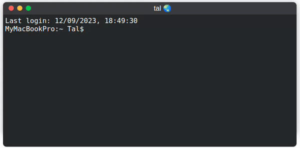

  <h3>functional terminal window macOS style</h1>
  <h4>customizable floating window UI component built using HTML, CSS, and JavaScript. The floating window provides a modern and intuitive interface. 
    
Features: 

Draggable: Users can easily drag the window by clicking and holding the title bar. 
Resizable: The window can be resized between two states: normal and maximized. 
Minimize: The window can be minimized to a small bar at the bottom. 
Interactive Buttons: The window includes interactive buttons for close, minimize, and maximize actions. 
Dynamic Content: The content inside the window is dynamic and can be updated as needed. 
Stylish Design: The UI features a sleek and stylish design with customizable colors. 
  </h4>
  
  

  
  

